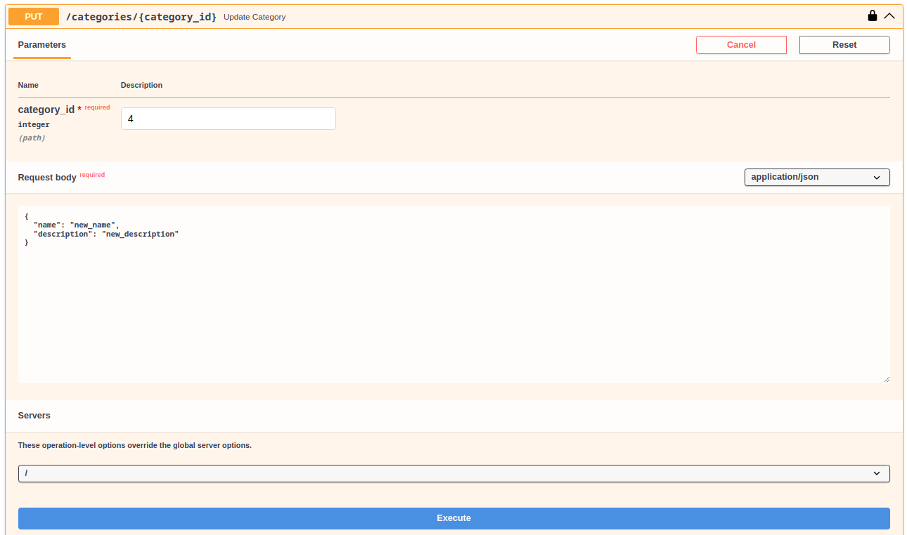
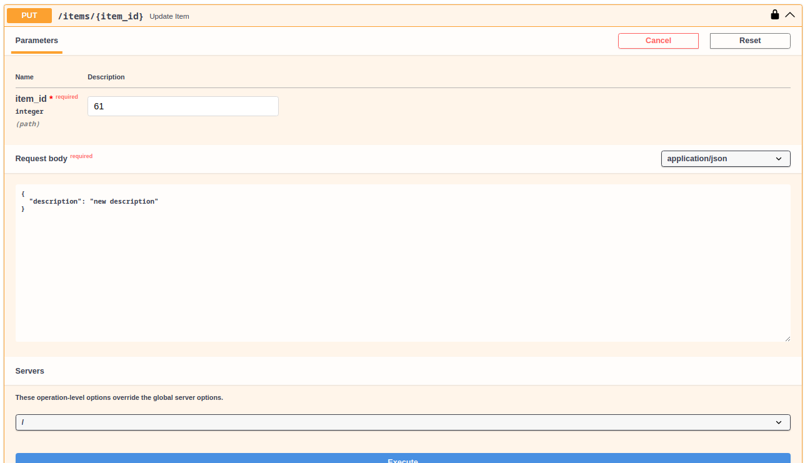
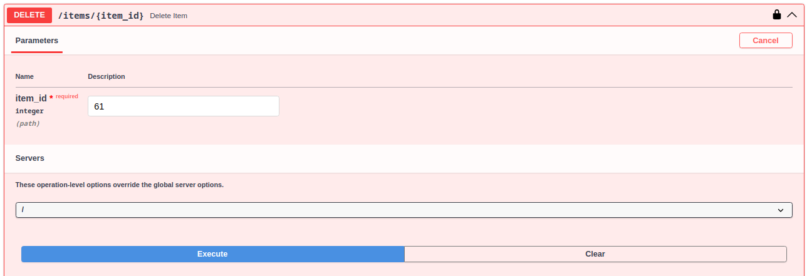

## API documentation

## Table of contents

- [API usage](#api-usage)
   - [Categories CRUD](#categories-crud)
   - [Items CRUD](#items-crud)

### API usage

#### Categories CRUD

> **WARNING**
> To access these endpoints you should be authorized as a superuser.

1. Category creation:
   - Request:
     

   - Response:
     

2. Category get by id:
   - Request:
     

   - Response:
     

3. Get categories:
   - Request:
     

   - Response:
     

4. Category update:
   - Request:
     

   - Response:
     

5. Category delete:
   - Request:
     

   - Response:
     

#### Items CRUD

> **WARNING**
> To access these endpoints you should be authorized.

1. Item creation:
   - Request:
     

   - Response:
     

2. Item get by id:
   - Request:
     

   - Response:
     

3. Get items:
   - Request:
     

   - Response:
     

4. Item update:
   - Request:
     

   - Response:
     

5. Item delete:
   - Request:
     

   - Response:
     

