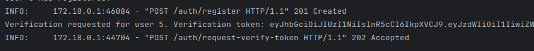
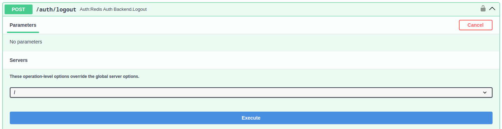

## Users documentation

## Table of contents

- [Users](#users)
    - [User registration](#user-registration)
    - [User verifying](#user-verifying)
    - [User log in](#user-log-in)
    - [User log out](#user-log-out)

### Users

Auto-generated API documentation you can find by [the link](http://0.0.0.0:8000/docs#/).

> NOTE: to grant superuser privileges to user change the `is_superuser` field value in `User` table for this user or
> update user info with already registered superuser via PATCH /users/{id} endpoint.

#### User registration

First of all you need to register new user.

- Registration request:
  

- Registration response on success:
  

After registration you need to [verify](#user-verifying) user.

#### User verifying

Verifying process includes request for token and user verification with this token.

1. Getting verification token:

    - Request token for user validation:
      

    - Token is not in response:
      

    - You can find token in api-service logs (since the token isn't sent via email or smth else, it's just printed in
      the service logs):
      

2. Using the received token we verify the user:

    - Verifying request:
      

    - Verifying response on success:
      

#### User log in

1. With username and password you can log in and get token:

    - User login request:
      

    - User login response:
      

2. Or simple authorize with `Authorize` button on the docs page:

    - Authorization form:
      

    - Successful authorization:
      

#### User log out

To log out just send request to `/auth/logout` endpoint.

- Logout request:
  

- Logout response:
  

- Logout response if user is not logged in:
  
